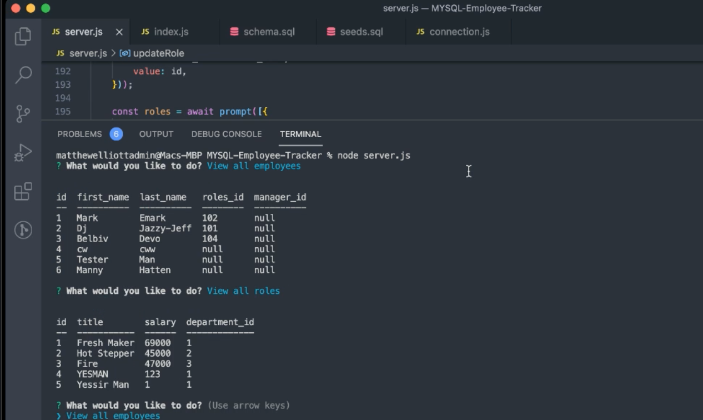

# MySQL Employee Tracker

## The Assignment
This app allows employers to view, add, and update employees, departments, and rolls within their company. Using NodeJS, MySQL, and Inquirer to create a CLI UI.

## Links
[Repo](https://github.com/MatteoThomas/MYSQL-Employee-Tracker)

[Video](https://drive.google.com/file/d/1jGfYHx5l8TI5WrzwcFq0fc11xcTDHeec/view)

## Contributors
 Matthew Elliott
 
 Github: [MatteoThomas](https://github.com/MatteoThomas)

## Technologies
NodeJS
Inquirer
MySQL

## Preview

